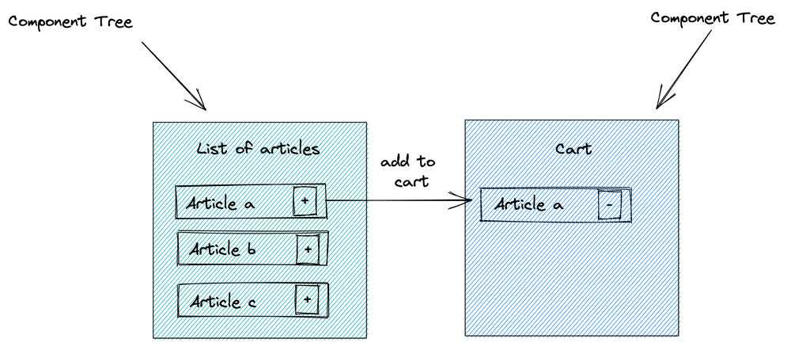
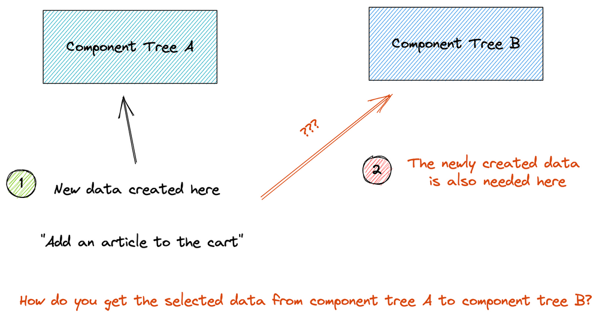
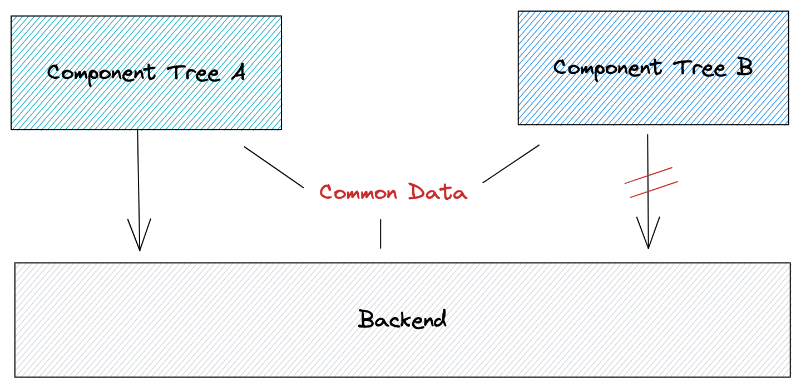
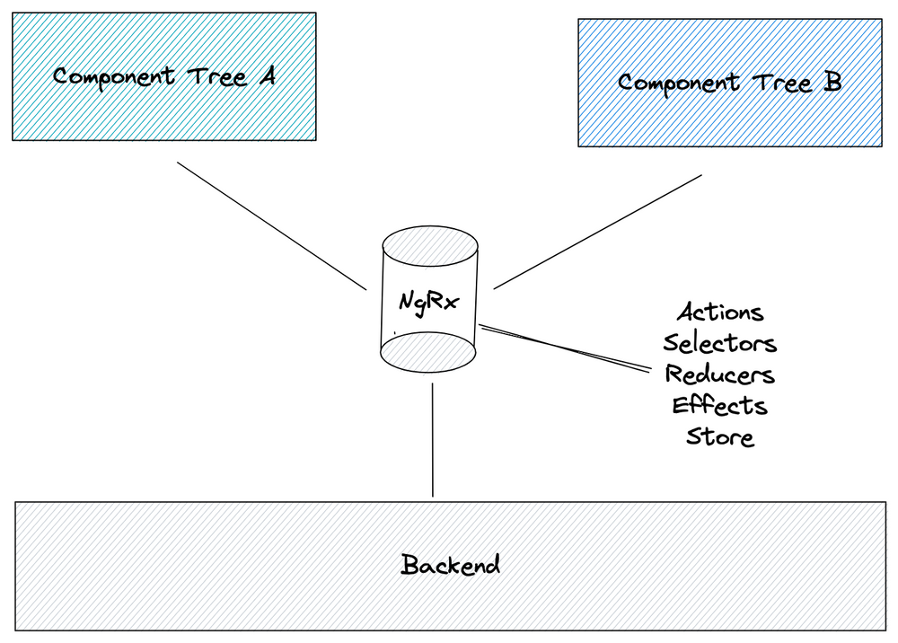
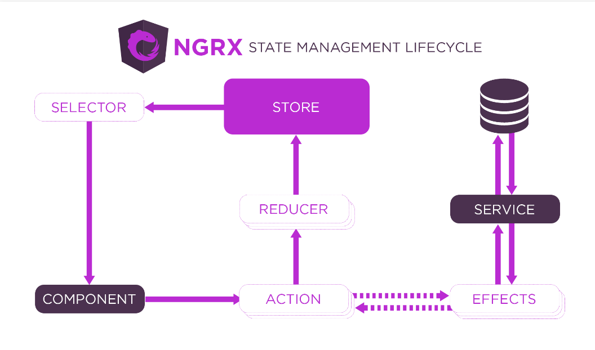

# **Chủ đề tuần 6**

- State Management(ngRx)

## 1. Trạng thái(State) của ứng dụng là gì?

- Dữ liệu phản hồi từ Server
- Thông tin người dùng
- Dữ liệu người dùng nhập vào
- State giao diện
- Router / location state

## 2. Tại sao cần phải quản lý trạng thái?

- Vì **state** trong ứng dụng của bạn có thể được biểu diễn ở bất cứ kiểu dữ liệu nào cũng như nó có thể nằm rải rác ở khắp các component nhỏ (hoặc không) nên tất nhiên chúng ta cũng cần phải quản lý nó. Những gì mà bạn cần quản lý ở đây sẽ bao gồm đặt state A này ở component nào, truyền state B từ component B đến component C như thế nào hay làm sao để thay đổi state X ở component Y.

## **3. NgRx là gì và nó được sử dụng để quản lý trạng thái ứng dụng như thế nào?**

### a. NgRx là gì

- NgRx là một khuôn khổ(framework) để xây dựng các ứng dụng web tương tác trong Angular.
- NgRx cung cấp các thư viện cho:
    - Managing gloabal and local state. (**Quản lý state cục bộ và toàn cục**)
    - Isolation of side effects to promote a cleaner component architecture.(**Cách ly các tác dụng phụ để thúc đẩy kiến trúc thành phần sạch hơn.)**
    - Entity collection management.(**Quản lý các bộ thực thể**)
    - Integration with the Angular Router.(**Tích hợp với Angular Router**)
    - Developer tooling that enhances developer experience when building many different types of applications.(**Công cụ dành cho nhà phát triển giúp nâng cao trải nghiệm của nhà phát triển khi xây dựng nhiều loại ứng dụng khác nhau.**)

### b. NgRx xử lý vấn đề như thế nào?

- Ở cấp độ cao NgRx chủ yếu xử lý hai kịch bản chính**:**
    - Chia sẻ data giữa các components khác nhau
    - State toàn cục để tải sử dụng dữ liệu
    
    **b.1 Chia sẻ data giữa các component khác nhau:**
    
    Trong một ứng dụng web phức tạp, bạn có các phần khác nhau. Hãy tưởng tượng tình huống sau: Trong một cửa hàng trực tuyến, bạn có một danh sách mặt hàng và giỏ hàng của mình. Hai phần này của cửa hàng web là các cây thành phần khác nhau, có thể nằm trong các mô-đun Angular khác nhau. Trong danh sách mặt hàng, người dùng nhấp vào một mặt hàng cụ thể  "Thêm vào giỏ hàng của tôi". Sau khi nhấp chuột, mặt hàng xuất hiện trong giỏ hàng.
    
    
    
    Mặt hàng này được đưa vào components của giỏ hàng như thế nào? Việc trao đổi dữ liệu của bạn giữa các components này là cần thiết.
    
    
    
    **b.2** ****cung cấp state toàn cục để sử dụng lại dữ liệu:****
    
    Trong ví dụ trên, bạn cũng không muốn tải cùng một dữ liệu hai lần. Trong ví dụ này, bạn muốn sử dụng lại dữ liệu mặt hàng như hình ảnh, tên mặt hàng và giá trong các thành phần giỏ hàng phải không? Vì vậy cần có một kho lưu trữ dữ liệu chung, một trạng thái toàn cục.
    
    (common data: dl chung)
    
    
    
    NgRx cung cấp một cửa hàng toàn cầu và các khối xây dựng khác nhau xung quanh cửa hàng, chẳng hạn như Action, Redux, Selector và Effect, để quản lý cửa hàng này như thể hiện trong hình sau:
    
    
    

### c. Các thành phần trong NgRx?



1. Store: Nới chứa các State
2. Action: Thể hiện các hành động và thao tác khi muốn thay đổi State
3. Reducer: Thực hiện chuyển đổi State từ trạng thái này sang trạng thái khác
4. Selector: Thể hiện vùng chọn của các state được lưu trữ trong Store

## 4. NgRx@store

Nó cung cấp một cửa hàng duy nhất để thể hiện trạng thái toàn cầu, trên toàn ứng dụng

**S*tore* dựa trên một cấu trúc dữ liệu duy nhất, bất biến. S*tore* cũng được tối ưu hóa để truy xuất dữ liệu trạng thái cụ thể.**

Để truy cập Store, bạn chỉ cần Inject nó. Trong Store, bạn có thể chọn dữ liệu bằng cách sử dụng selectors hoặc dispatch actions.

```tsx
import {Store} from "@ngrx/store";
import {getItems} from "../../actions/items-page.actions";
 
this.store.dispatch(getItems());
```

**2.1 Key concept:**

- Các hành động mô tả các sự kiện duy nhất được gửi đi từ các component và service.
- Các thay đổi trạng thái được xử lý bởi các hàm thuần túy được gọi là redux lấy trạng thái hiện tại và hành động mới nhất để tính toán trạng thái mới.
- Selectors là các hàm thuần túy được sử dụng để chọn, lấy và tổng hợp các phần trạng thái.
- Trạng thái được truy cập với , một trạng thái có thể quan sát được và một observer của action.Store

## 5. NgRx@effect

*[Hiệu ứng](https://ngrx.io/guide/effects)* là một mô hình tác dụng phụ dựa trên RxJS cho cửa hàng. Hiệu ứng sử dụng luồng để cung cấp nguồn mới cho hành động. Tác dụng cô lập tác dụng phụ từ các thành phần. Điều này cung cấp cho chúng ta các thành phần "tinh khiết hơn" chọn trạng thái và thực hiện các hành động.

```tsx
loadArticles$ = createEffect(() => this.actions$.pipe(
      ofType(getItems),
      mergeMap(() => this.articleService.getItems()
        .pipe(
          map(items => (itemsLoadedSuccessfully({data: items}))) 
        ))
    )
  );
```

**3.1 Key concept:**

- **Tác dụng cô lập tác dụng phụ từ các thành phần, cho phép các thành phần *tinh khiết* hơn chọn trạng thái và hành động điều phối.**
- **Hiệu ứng là các dịch vụ chạy lâu dài lắng nghe *mọi hành động* được gửi từ [Store](https://ngrx.io/guide/store)**.
- **Hiệu ứng lọc những hành động đó dựa trên loại hành động mà họ quan tâm. Điều này được thực hiện bằng cách sử dụng một toán tử.**
- **Hiệu ứng thực hiện các tác vụ, đồng bộ hoặc không đồng bộ và trả về một hành động mới.**

NgRx Effect có thể lắng nghe và nhận vào 1 action xử lý để trả ra một action khác để xử lý

```tsx
import { Injectable } from '@angular/core';
import { Actions, createEffect, ofType } from '@ngrx/effects';
import { EMPTY } from 'rxjs';
import { map, mergeMap, catchError } from 'rxjs/operators';
import { MoviesService } from './movies.service';

@Injectable()
export class MovieEffects {

  loadMovies$ = createEffect(() => this.actions$.pipe(
    ofType('[Movies Page] Load Movies'),
    mergeMap(() => this.moviesService.getAll()
      .pipe(
        map(movies => ({ type: '[Movies API] Movies Loaded Success', payload: movies })),
        catchError(() => EMPTY)
      ))
    )
  );

  constructor(
    private actions$: Actions,
    private moviesService: MoviesService
  ) {}
}
```

- Như ví dụ trên ta có loadMovies$ là một Effect đang lắng nghe tất cả các hành động được gửi qua luồng Action, nhưng ở đây ta chỉ quan tâm đến event **[Movies Page] Load Movies** bằng cách sử dụng toán tử **ofType.** Luồng Action sau đó được xử lý và ảnh xạ thành luồng mới có thể quan sát được bằng bằng cách sử dụng toán tử **mergeMap.** Phương thức **moviesService.getAll()** trả về một observable có thể map một bộ phim tới một **Action** mới khi thành công và trả về empty observable nếu trường hợp có xảy ra lỗi. Action sau đó được gửi đến Store nơi nó có thể được xử lý bởi **Reducers** khi cần thay đổi trạng thái.

Ta cũng có thể sử dụng điều trên để thực hiện bắt lỗi(****Handling Errors)**** trong TH có lỗi xảy ra thì ta sẽ tạo ra một **Action** để trả về cho **Store** xử lý(cụ thể là Reducers).

```tsx
import { Injectable } from '@angular/core';
import { Actions, createEffect, ofType } from '@ngrx/effects';
import { of } from 'rxjs';
import { map, mergeMap, catchError } from 'rxjs/operators';
import { MoviesService } from './movies.service';

@Injectable()
export class MovieEffects {

  loadMovies$ = createEffect(() =>
    this.actions$.pipe(
      ofType('[Movies Page] Load Movies'),
      mergeMap(() => this.moviesService.getAll()
        .pipe(
          map(movies => ({ type: '[Movies API] Movies Loaded Success', payload: movies })),
          catchError(() => of({ type: '[Movies API] Movies Loaded Error' }))
        )
      )
    )
  );

  constructor(
    private actions$: Actions,
    private moviesService: MoviesService
  ) {}
}
```

## 6. Khi nào cần sử dụng NgRx?

NgRx là một giải pháp phổ biến trong hệ sinh thái Angular nếu bạn đang xây dựng các ứng dụng web phức tạp với khả năng quản lý trạng thái tinh vi. Đặc điểm của nhu cầu về NgRx là có nhiều tương tác người dùng và nhiều nguồn dữ liệu.

[NgRx](https://ngrx.io/) sử dụng tốt trong các TH:

- **trạng thái được truy cập bởi nhiều thành phần và dịch vụ**
- **trạng thái cần có sẵn khi nhập lại các routes**
- **state bị ảnh hưởng bởi các hành động từ các nguồn khác nhau.**

## 7. Khi nào không cần sử dụng?

[NgRx](https://ngrx.io/) có thể không khả thi hoặc chỉ làm ứng dụng trở nên khó ql hơn nếu:

- bạn đang xây dựng các Ứng dụng Web nhỏ với các thành phần bị cô lập.
- nhóm của bạn không thực sự quen thuộc với cách tiếp cận phản ứng.
